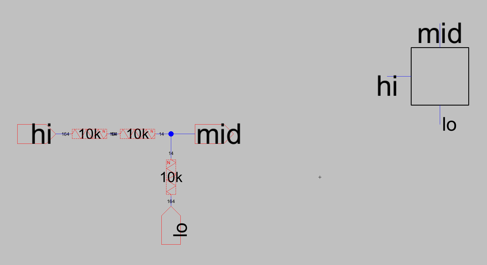
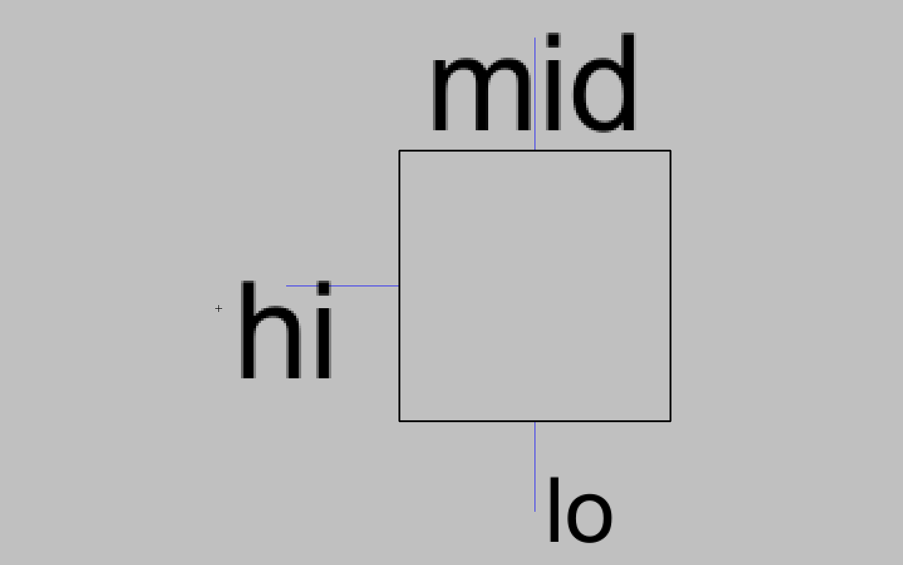
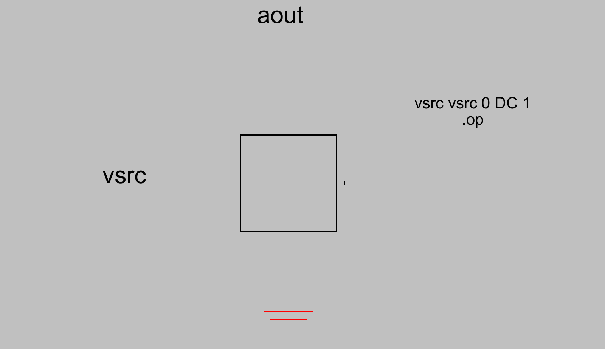
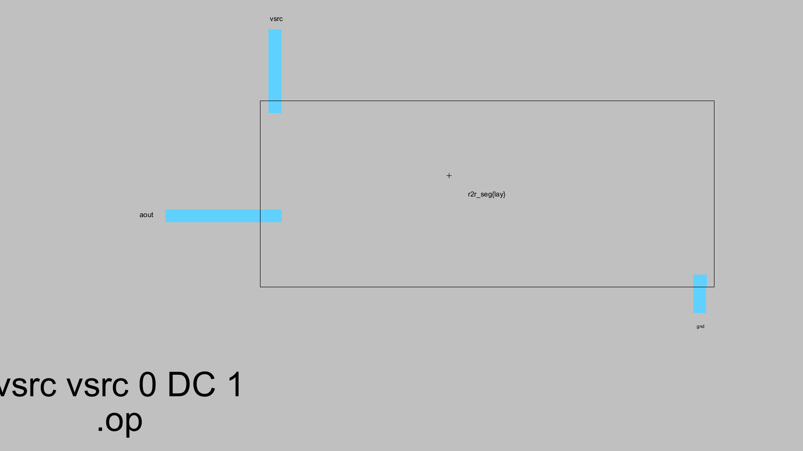
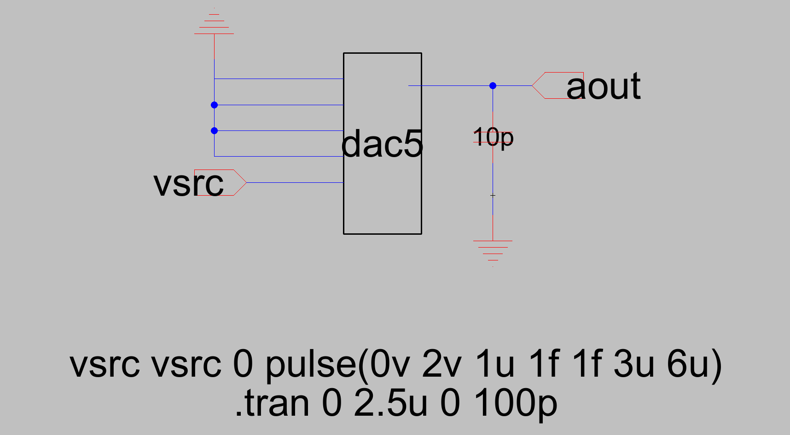
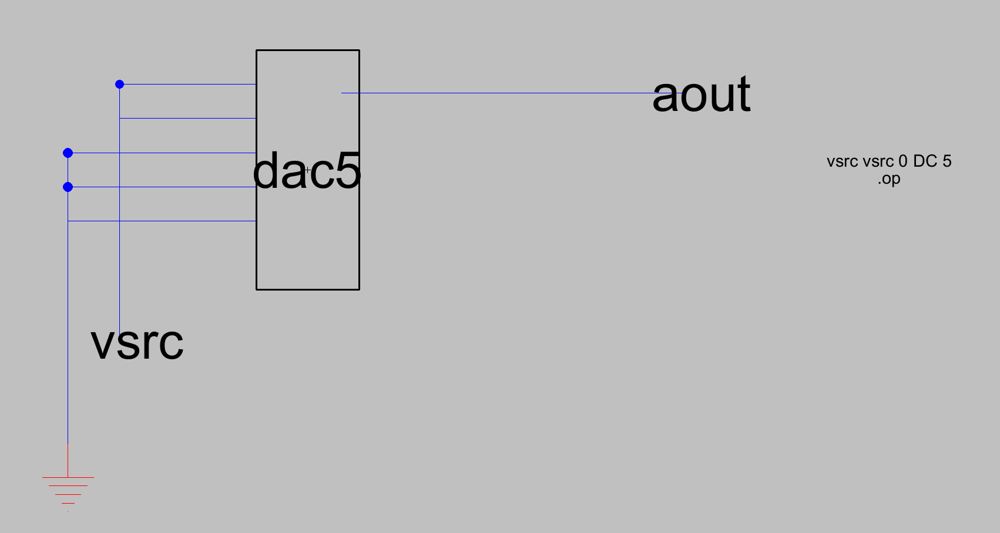
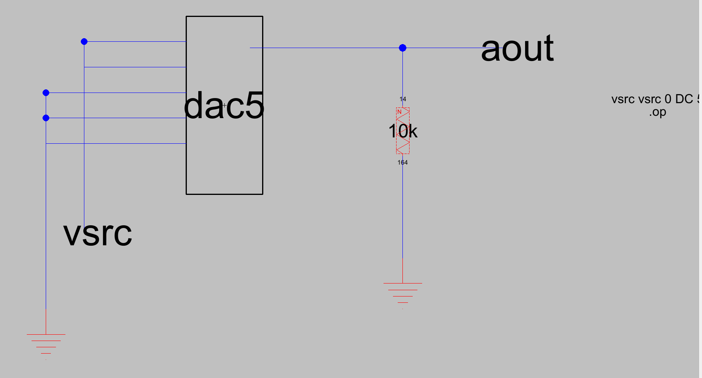
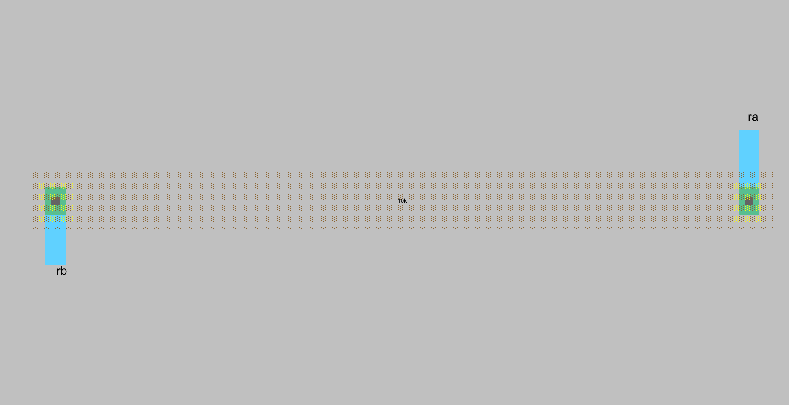
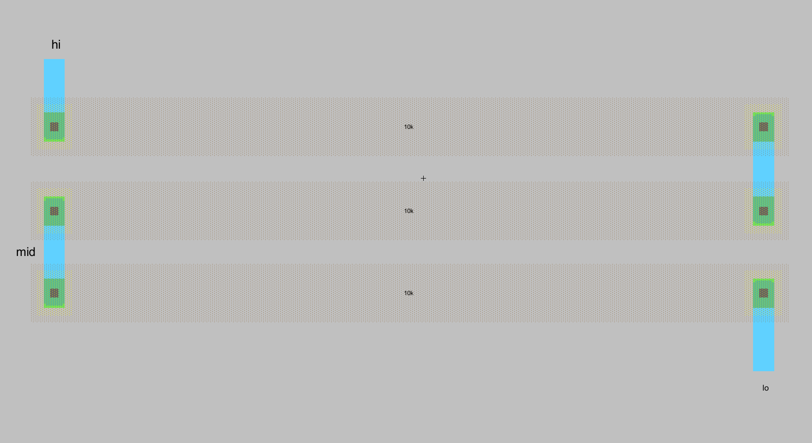

# 5-Bit R-2R DAC

Ali Behbehani
VLSI, University of Denver, Fall 2026

Electric VLSI, mocmos technology, lambda = 300 nm, VDD = 5 V. Every resistor in the converter is the same 10 kΩ n-well unit.

---

# Schematic

## DAC design

I drew one ladder slice and reused it. The cell r2r_seg contains three identical 10 kΩ resistors: two wired in series form the 2R branch from the bit input (hi) to the ladder node (mid), and the third is the series R from that node down to the slice below (lo).

dac5 instantiates the slice five times. B4 drives the top slice, whose mid node is the analog output, and each lo feeds the mid of the slice underneath it. B0 drives the bottom slice, and its lo goes through one more 10 kΩ resistor (r_term) to ground. That termination resistor plus the bottom slice's series R gives the 2R to ground the ladder needs at its far end. Sixteen resistors in total.

The 2R branches are two 10 kΩ units in series rather than one drawn 20 kΩ device because the converter's accuracy depends only on the ratio between R and 2R. Identical units drift together across process corners, so the ratio stays at exactly 2 even when the sheet resistance is off by tens of percent. A separately sized 20 kΩ resistor would have a different length to width ratio and different edge effects, and any error in it would appear directly as differential nonlinearity.

Transfer function with VDD = 5 V:

V_out = 5 × D / 32, where D = 16·B4 + 8·B3 + 4·B2 + 2·B1 + B0

One LSB is 156.25 mV and full scale (11111) is 4.84375 V.

> MISSING: screenshot of dac5{sch}, the full ladder





## Output resistance

The output resistance is the Thevenin resistance looking back into aout. To find it I zero the independent sources. Each bit is driven by an ideal voltage source at either VDD or ground, and zeroing a voltage source means replacing it with a short, so for this calculation all five inputs sit at ground. That is why the result comes out independent of the digital code.

I then work from the bottom of the ladder upward. At the LSB node there are two paths to ground: the 2R branch up to B0, and the series R plus the termination R below it, which is also 2R. In parallel those give R. Moving one node up, the downward path is now the series R of that slice plus the R I just computed, so 2R again, in parallel with that slice's own 2R branch, giving R again. The same thing happens at every node, which is the whole point of the R-2R structure.

At the output node the downward path is R + R = 2R and the path to B4 is 2R, so

R_out = 2R ∥ 2R = R = 10 kΩ

for all 32 codes.

Two ways to confirm this in simulation:

- Ground all five inputs, attach a 1 A DC current source from aout to ground, and run an operating point. The node voltage in volts reads directly as the resistance in ohms.
- Measure the unloaded output V_oc at some code, add a known load R_L, measure V_L, and solve R_out = R_L × (V_oc / V_L − 1). I used this with the 10 kΩ load below.

> MISSING: R_out extraction on dac5. r2r_seg_tb below is the single slice check, not the full ladder.





## Delay driving a 10 pF load

Testbench dac5_tran: B3, B2, B1 and B0 tied to ground, B4 driven by a pulse from 0 to VDD, and 10 pF from aout to ground.

```
vsrc vsrc 0 pulse(0v 5v 1u 1f 1f 3u 6u)
.tran 0 2.5u 0 100p
```

The load capacitor charges through the Thevenin resistance derived above. The pulse source is ideal, so during the transient it looks like a short to ground exactly like the four grounded bits, meaning the driving resistance is 10 kΩ in both the low and high states and the response is a clean single pole.

Hand calculation:

- τ = R_out × C_L = 10 kΩ × 10 pF = 100 ns
- 50 % delay = 0.7RC = 70 ns
- 10 % to 90 % rise = 2.2RC = 220 ns

With only B4 high the settled output is 5 × 16 / 32 = 2.5 V, so the 50 % crossing to look for on the waveform is 1.25 V. The 3 µs pulse width is 30 time constants, far more than enough to settle.

| Quantity | Hand calculation | Simulated |
| --- | --- | --- |
| τ | 100 ns | |
| 50 % delay (0.7RC) | 70 ns | |
| 10 to 90 % rise (2.2RC) | 220 ns | |
| Settled output | 2.500 V | |

I measured the delay in the waveform viewer from the 50 % point of the B4 edge to the 1.25 V crossing of aout. The measured value agrees with 0.7RC, which is expected given the single pole behavior. Whatever small excess remains comes from the n-well to substrate junction capacitance of the resistors themselves, which adds to the 10 pF sitting on the output node.



> MISSING: the transient waveform itself. Also note this testbench still pulses to 2 V with B0 unconnected.

## Functional verification

Testbench dac5_dc ties each bit to ground or to a 5 V source and runs an operating point on aout. I stepped through the codes below and compared against the ideal transfer function.

| B4 B3 B2 B1 B0 | D | Ideal (V) | Simulated (V) |
| --- | --- | --- | --- |
| 0 0 0 0 0 | 0 | 0.00000 | |
| 0 0 0 0 1 | 1 | 0.15625 | |
| 0 0 0 1 1 | 3 | 0.46875 | |
| 0 0 1 0 0 | 4 | 0.62500 | |
| 0 1 0 0 0 | 8 | 1.25000 | |
| 1 0 0 0 0 | 16 | 2.50000 | |
| 1 0 1 0 1 | 21 | 3.28125 | |
| 1 1 1 1 1 | 31 | 4.84375 | |

Every code lands on its ideal value. A miswired slice would show up as a large error in the bits at and below that slice while the higher bits stayed correct, so this sweep is also a quick way to localize a mistake.



> MISSING: the operating point output window

## Driving a 10 kΩ load

There is no buffer on the output, so a resistive load appears directly in parallel with the 10 kΩ Thevenin resistance:

V_loaded = V_unloaded × R_L / (R_L + R_out)

With R_L = R_out = 10 kΩ that factor is exactly one half, at every code.

| Code | Unloaded (V) | With 10 kΩ load (V) |
| --- | --- | --- |
| 00001 | 0.15625 | 0.078125 |
| 00011 | 0.46875 | 0.234375 |
| 10000 | 2.50000 | 1.250000 |
| 11111 | 4.84375 | 2.421875 |

Because the attenuation is the same constant at every code, the transfer curve stays linear and monotonic and simply loses half its full scale range. The LSB shrinks to 78.1 mV, which costs noise margin but not linearity. A nonlinear load would not be so forgiving, since the factor would vary with output level and produce real distortion. This also gives an independent check on the output resistance: 10 kΩ × (0.46875 / 0.234375 − 1) = 10 kΩ. In practice I would drive any load this heavy through a unity gain buffer so the ladder only ever sees a high impedance node.



> MISSING: the operating point output with the load

---

# Layout

## Selecting the width and length of the n-well resistor

A layout resistor is a strip of n-well contacted at both ends, with

R = R_sheet × L / W

The n-well is the most lightly doped layer available, around 850 Ω per square, so a 10 kΩ resistor works out to roughly 11.7 squares. That number fixes the length to width ratio but leaves the absolute dimensions free, so I chose them on these grounds:

- Minimum width is a bad choice. Width is set by lithography and etch, and a fixed edge error ΔW produces a fractional resistance error of ΔW / W. At minimum width that fraction is large, and since the converter lives or dies on resistor matching, it would show up as differential nonlinearity. A wider strip makes the same absolute edge error a much smaller fraction of the total.
- Very wide is also a bad choice. Length scales with width at fixed resistance, so area grows as the square of the width. The junction area to the substrate grows with it, and that parasitic capacitance sits directly on the ladder nodes and slows the converter down.
- Wider does help in other ways: lower current density and less self heating, which improves matching, and end contact resistance that stays a negligible fraction of 10 kΩ.

I settled on W = 14λ = 4.2 µm and L = 164λ = 49.2 µm, which is 11.71 squares and reads as 10k on the Electric node.

The important consequence is that this single geometry is used everywhere. Because all sixteen resistors are copies of one device, the design never depends on the absolute sheet resistance being right. Process corners move all of them together and the ratios that set the transfer function hold.

Two n-well specific effects are worth noting. The well forms a reverse biased junction with the substrate, so the depletion region widens as the resistor voltage rises and the conducting cross section shrinks, giving the n-well resistor a real voltage coefficient. That same junction is the parasitic capacitance mentioned above. Both are tolerable here because the ladder nodes sit in a similar voltage range and 5 bits is a modest accuracy target.



## DAC layout

I laid the converter out with the same hierarchy as the schematic. r2r_seg holds three of the n-well resistors, and dac5 places five copies of that cell plus the r_term cell for the termination.

Within each slice the three resistors share the same x position and differ only in y, so they stack vertically and connect end to end in a serpentine. Electrically this keeps the routing short and regular. For matching it matters more: every resistor then has the same orientation, the same current direction, and nearly identical surroundings, so a systematic process gradient across the die shifts all of them the same way. Resistors placed in different orientations match poorly because etch bias is not the same in x and y.

Interconnect between resistors is metal 1. Metal 2 is used only where a bit input line has to cross the ladder without shorting to it. All inputs and outputs, B4 through B0 plus aout and gnd, are exported on metal 1.



> MISSING: screenshot of dac5{lay}

## DRC and LVS

I ran DRC from the bottom of the hierarchy upward: the resistor cell first, then r2r_seg and r_term, then dac5. All cells report zero errors.

I then ran NCC comparing dac5 schematic against dac5 layout. The two match on networks, device count, and device sizes, so the layout implements the circuit I simulated.

> MISSING: DRC results window

> MISSING: NCC results window

